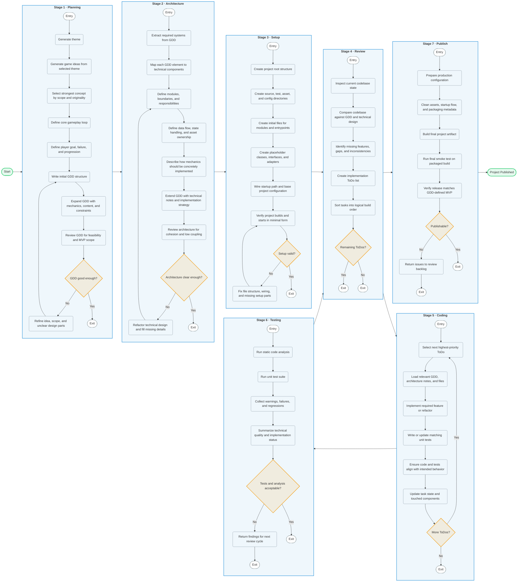

# MiniDev

MiniDev is an autonomous development pipeline that guides a software project from initial concept to a published state. By leveraging AI to manage the software development lifecycle, it automates critical tasks ranging from high-level planning to final deployment.

## About this Project

MiniDev is a Java-based framework designed to explore the boundaries of autonomous software engineering. By integrating structured pipeline stages with agentic workflows, it aims to create self-contained, functional software artifacts with minimal human intervention.

## Key Features

- **Autonomous Pipeline:** Automates the full lifecycle from design to release.
- **Agentic Workflow:** Intelligent task management that aligns code with design goals.
- **Iterative Development:** Continuous loop of design, implementation, and verification.
- **Modular Architecture:** Extensible stages for planning, architecture, and coding.

## Getting Started

### Prerequisites
- Java 25+
- Maven

### Build & Run
You can run the application using the Maven wrapper:

```bash
./mvnw clean install
./mvnw spring-boot:run
```

The application will start on `http://localhost:8080`.

## Tech Stack
- **Language:** Java 25+
- **Framework:** Spring Boot
- **Frontend:** Thymeleaf, JavaScript (Vanilla)
- **Architecture:** Agentic Pipeline Pattern

## Project Structure

- `src/main/java`: Core logic and pipeline implementation.
- `src/test/java`: Automated unit tests and test suites.
- `docs/`: Project documentation and architecture diagrams.

## Pipeline Overview

The following diagram illustrates the lifecycle of a project within the MiniDev framework, moving through seven core stages: Planning, Architecture, Setup, Review, Coding, Testing, and Publishing.



## Core Philosophy

MiniDev operates on the principle of self-evolving software development. By maintaining a continuous loop between design, implementation, and verification, it ensures that project goals remain aligned with the actual codebase. This approach fosters a highly iterative process where documentation and implementation evolve in tandem.

## Detailed Stage Breakdown

- **Planning:** Conceptualization of the project theme and definition of the MVP scope through GDD generation.
- **Architecture:** Translating GDD elements into technical components, defining modules, data flow, and asset ownership.
- **Setup:** Initializing the project structure, source directories, boilerplate code, and verification of the initial build.
- **Review:** Bridging the gap between design and implementation through continuous assessment and task prioritization.
- **Coding:** Iterative feature implementation based on prioritized tasks, guided by documentation and verified with unit tests.
- **Testing:** Comprehensive validation through static analysis and automated test suites to ensure technical quality.
- **Publishing:** Finalizing configurations, building the release artifact, and performing smoke tests to verify MVP readiness.

## Contributing

Contributions are welcome! If you'd like to improve MiniDev, please fork the repository and submit a pull request.

